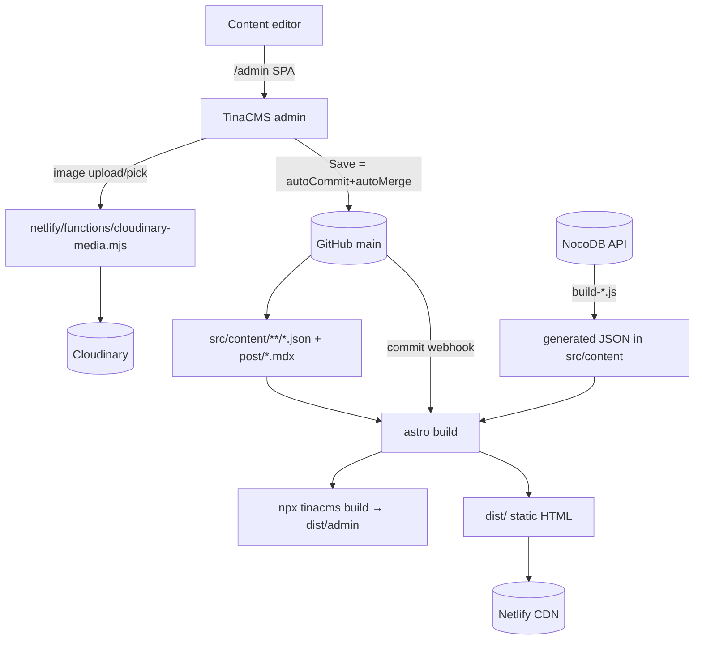

# TinaCMS Architecture — Out of the Books (Astro)

> Reference for working on TinaCMS in this repo (`/Users/pwablo/Documents/GitHub/ootb`). **Do not assume newer TinaCMS APIs.**

## 0. Version pinning (CRITICAL)

This site runs an **older, specific** TinaCMS line. Work MUST target these versions.

| Package | Pinned (`package.json`) | Installed |
|---|---|---|
| `tinacms` | `^2.10.1` | 2.10.1 |
| `@tinacms/cli` | `^1.12.6` | 1.12.6 |
| `@tinacms/schema-tools` | `1.10.1` | (transitive of tinacms 2.10.1) |
| `@tinacms/graphql` | `1.6.3` | (transitive) |
| `@tinacms/app` | `2.3.11` | 2.3.11 |
| `@tinacms/search` | `1.1.3` | (transitive) |
| `next-tinacms-cloudinary` | `^16.0.1` | 16.0.1 |
| `@tinacms/auth` | `^1.0.11` | 1.1.1 (used by the Cloudinary Netlify function) |

Node engine: `^20.3.0 || ^22.0.0`. Netlify builds on Node 22 (`netlify.toml`).

**Things that differ in newer TinaCMS — match this repo's exact shape:**
- The `gitProvider` block (self-hosted/Tina-backend feature) has shifted across releases — do not add new keys.
- `search` config keys (`indexBatchSize`, `maxSearchIndexFieldLength`, `stopwordLanguages`) are stable in 1.1.x.
- `ui.itemTable` / `tableColumns` (used in `postsCollection.js`) is an older list-view API — keep its current shape.

## 1. `tina/config.ts` — `defineConfig`

Full file: `tina/config.ts` (~66 lines). Imports each collection from its own module and passes them into `schema.collections`.

```ts
import { defineConfig } from "tinacms";
import { postsCollection } from "./postsCollection";
// ...one import per collection file...

export default defineConfig({
  branch: "main",
  clientId: process.env.TINA_CLIENT_ID,
  token: process.env.TINA_TOKEN,
  build:  { outputFolder: "admin", publicFolder: "public" },
  media:  { loadCustomStore: async () => (await import("next-tinacms-cloudinary")).TinaCloudCloudinaryMediaStore },
  schema: { collections: [ /* ...12 collections... */ ] },
  search: { tina: { indexerToken: process.env.TINA_SEARCH_TOKEN, stopwordLanguages: ['fra','eng'] },
            indexBatchSize: 100, maxSearchIndexFieldLength: 200 },
  gitProvider: { name: 'github', branch: 'main', authProvider: 'github', autoCommit: true, autoMerge: true },
});
```

- **`branch: "main"`** — the Git branch TinaCloud reads/writes. Editing always targets `main` (even when a working branch like `preview/...` is checked out).
- **`clientId` / `token`** — TinaCloud project id + content token (env `TINA_CLIENT_ID`, `TINA_TOKEN`). Referenced here and in generated `tina/__generated__/config.prebuild.jsx`.
- **`build`** — `publicFolder: "public"`, `outputFolder: "admin"` → the admin SPA is built into **`public/admin/`** (gitignored). In dev, `astro dev` serves it at **`/admin/index.html`**; in prod, the build order **`tinacms build && astro build`** lets `astro build` copy `public/admin` → `dist/admin`. (Previously `publicFolder: "dist"` with the reverse order — that broke the local dev admin, since `astro dev` doesn't serve `dist/`.)
- **`media.loadCustomStore` → Cloudinary** — replaces git-based media with `next-tinacms-cloudinary` (`TinaCloudCloudinaryMediaStore`). The server side is a **Netlify Function** (not a Next route): `netlify/functions/cloudinary-media.mjs`, which uses `@tinacms/auth` (`isAuthorized`) and Cloudinary creds. Any `image`-type field uploads/picks through this.
- **`search`** — `tina.indexerToken` (env `TINA_SEARCH_TOKEN`, TinaCloud only), French+English stopwords, batch 100, max field length 200. Dev builds the index live; prod builds + uploads it at `npx tinacms build`. See `tina/README-SEARCH.md`.
- **`gitProvider`** — GitHub, branch `main`, `autoCommit: true` (Save commits directly, no draft staging), `autoMerge: true` (merges straight to `main`, no PR). Net effect: **every editor save = an immediate commit to `main`**, which triggers Netlify rebuilds.

## 2. Collections registry (`schema.collections`)

| # | Symbol | File | `name` | `label` | `path` | `format` |
|---|---|---|---|---|---|---|
| 1 | `postsCollection` | `tina/postsCollection.js` | `post` | 📚 Gestion des contenus | `src/content/post` | `mdx` |
| 2 | `homepageCollection` | `tina/homepageCollection.ts` | homepage | 📄 Page - Accueil | `src/content/homepage` | `json` |
| 3 | `festivalCollection` | `tina/festivalCollection.ts` | festival | — | `src/content/festival` | `json` |
| 4 | `appelProjetCollection` | `tina/appelProjetCollection.ts` | appelProjet | — | `src/content/appel_projet` | `json` |
| 5 | `blogCollection` | `tina/blogCollection.ts` | `blog` | 📄 Page - Nos contenus | `src/content/blog` | `json` |
| 6 | `aboutCollection` | `tina/aboutCollection.ts` | `about` | 📄 Page - À propos | `src/content/about` | `json` |
| 7 | `erasmusCollection` | `tina/erasmusCollection.ts` | `erasmusPlus` | 📄 Page - Erasmus+ | `src/content/erasmus-plus` | `json` |
| 8 | `contactCollection` | `tina/contactCollection.ts` | contact | — | `src/content/contact` | `json` |
| 9 | `siteSettingsCollection` | `tina/siteSettingsCollection.ts` | `siteSettings` | ⚙️ Paramètres généraux | `src/content/site` | `json` |
| 10 | `navigationCollection` | `tina/navigationCollection.ts` | navigation | — | `src/content/navigation` | `json` |
| 11–12 | `termsCollection`, `privacyCollection` | `tina/legalCollection.ts` | terms / privacy | — | (legal) | `json` |

- **One collection per file** (except `legalCollection.ts`, which exports two).
- `postsCollection` is the only **`.js`** + **`mdx`** collection; it imports `mediaFields` etc. from `tina/mediaFields.js`.
- `tina/legalPagesCollection.ts` (1 byte) and `tina/registerNavigation.js` exist but are **not** wired into `schema.collections`.

## 3. Collection definition pattern

### 3.1 Single-instance page collection (dominant)

```ts
import type { Collection } from "tinacms";

export const erasmusCollection: Collection = {
  name: "erasmusPlus",
  label: "📄 Page - Erasmus+",
  path: "src/content/erasmus-plus",
  format: "json",
  ui: { allowedActions: { create: false, delete: false } }, // single page → no add/remove
  fields: [ /* ... */ ],
};
```

- **`name`** — GraphQL identifier (camelCase).
- **`label`** — sidebar label, emoji-prefixed.
- **`path`** — dir under `src/content/…`; produces one `index.json`.
- **`ui.allowedActions: { create:false, delete:false }`** — on every single-page collection.
- **`defaultItem`** — seed values for empty docs (used by about/blog/siteSettings; erasmus has none).
- **`ui.itemProps`** — list-row labels: `ui: { itemProps: (item) => ({ label: item?.nom || "Nouveau partenaire" }) }`.
- **`ui.router`** — **NOT used anywhere** in this repo. No live-preview deep links.
- **`ui.beforeSubmit`** — only in `siteSettingsCollection` (force-redeploy stamp).

### 3.2 Field types actually used

- **`string`** — text input; with `list: true` → repeatable simple list.
- **`string` + `ui.component: "textarea"`** — multiline text (descriptions, intros).
- **`string` + `options: [{label,value}]`** — select dropdown.
- **`string` + `ui.component: "hidden"`** — hidden technical field (e.g. `system.deploymentTimestamp`).
- **`boolean`** — toggle.
- **`image`** — Cloudinary-backed media picker.
- **`object`** — grouping; with **`list: true`** → repeatable group (+ `ui.itemProps`). Nests deeply: `erasmusCollection.ressources.volets[].fichesCategories[].fiches[]` is 4 levels.
- **`rich-text`** — Tina rich-text editor; rendered via `<TinaMarkdown>` from `tinacms/dist/rich-text` (e.g. `about.missions[].description`).

No `reference`/`number`/`datetime` in the page collections.

### 3.3 Multi-document collection (`postsCollection.js`)

MDX, `path: "src/content/post"`, allows create/delete, uses `mdx.resolve` for `~/components/mdx`, and an older `ui.itemTable.tableColumns` list view with `render` functions. Body field is `rich-text` with `isBody: true` (serialized to MDX).

## 4. Data flow

Two independent pipelines feed the same Astro SSG build.

**Pipeline A — TinaCMS (editor, git-backed):** editor → `/admin` → edit (images → Cloudinary via Netlify function) → Save → `gitProvider` commits `src/content/**/index.json` to `main` → Netlify deploy → `astro build` reads JSON/MDX → static HTML. Astro consumes JSON by direct import (`import data from '~/content/<col>/index.json'`); rich-text via `<TinaMarkdown>`.

**Pipeline B — NocoDB (build scripts):** `src/services/api/nocodb.ts` + `src/scripts/build-*.js` fetch at build (`optimize:prebuild` / `prebuild`) → emit JSON into `src/content/festival/…` → Astro reads. Fetch-at-build-time, not commit-to-repo.



## 5. Environment variables & build commands

| Var | Purpose | Referenced in |
|---|---|---|
| `TINA_CLIENT_ID` | TinaCloud project id | `tina/config.ts` |
| `TINA_TOKEN` | TinaCloud content token | `tina/config.ts` |
| `TINA_SEARCH_TOKEN` | Search indexer (TinaCloud only) | `tina/config.ts`, `tina/README-SEARCH.md` |
| `CLOUDINARY_CLOUD_NAME` / `CLOUDINARY_API_KEY` / `CLOUDINARY_API_SECRET` | Cloudinary media store | `netlify/functions/cloudinary-media.mjs`, `.env.example` |
| `NOCODB_BASE_URL` / `NOCODB_API_TOKEN` | NocoDB pipeline (separate) | `src/config/nocodb.ts`, `.env.example` |

Scripts (`package.json`):
- **`npm run dev`** → `tinacms dev -c "astro dev"` — lance TinaCMS local (GraphQL filesystem sur :4001) + Astro (:4321) ensemble ; admin sur `http://localhost:4321/admin/index.html`. Variantes : `npm run dev:local` (`TINA_PUBLIC_IS_LOCAL=true …`, édition filesystem garantie sans cloud), `npm start` / `npm run dev:astro` (Astro seul, sans Tina), `npm run tina` = `tinacms dev` (Tina seul, sert aussi à régénérer `tina-lock.json` via `--no-server`).
- **`npm run build`** → `astro build && npx tinacms build`.
- **`build:netlify`** → `… astro build --silent && npx tinacms build --skip-cloud-checks`. `optimize:prebuild` runs the NocoDB scripts first; `--skip-cloud-checks` avoids failing the deploy on a transient/mismatched cloud check.
- Netlify build command is `bash scripts/smart-build.sh` (`netlify.toml`), which conditionally installs Poppler then calls `build:netlify`. `publish = "dist"`, `functions = "netlify/functions"`, `NODE_VERSION = "22"`.

## 6. Redeploy mechanism (editor-forced)

Editor path: Tina admin → **⚙️ Paramètres généraux** (`siteSettingsCollection`, `src/content/site`) → **Actions système** → **"Forcer le redéploiement du site"** (`system.triggerDeployment`) → Save.

```ts
ui: {
  beforeSubmit: async ({ values }) => {
    if (values.system && typeof values.system.triggerDeployment === 'boolean'
        && values.system.triggerDeployment) {
      values.system.deploymentTimestamp = new Date().toISOString();
      values.system.triggerDeployment = false; // reset toggle
    }
    return values;
  },
}
```

On save, `beforeSubmit` stamps a fresh hidden `system.deploymentTimestamp` and flips the boolean back → mutates `src/content/site/index.json` → `autoCommit`/`autoMerge` push to `main` → Netlify webhook → `bash scripts/smart-build.sh`. "Force redeploy" is just "commit a timestamp change," reusing the autoCommit→Netlify chain. No separate build-hook call in code.

## 7. Documentation references (read for the 2.x / older API)

- Config — https://tina.io/docs/reference/config
- Collections / schema — https://tina.io/docs/reference/collections, https://tina.io/docs/schema
- Field types — https://tina.io/docs/reference/types
- Rich-text rendering — https://tina.io/docs/reference/types/rich-text (`<TinaMarkdown>` from `tinacms/dist/rich-text`)
- Custom field UI — https://tina.io/docs/extending-tina/customize-list-ui (`itemProps`, `component`, `beforeSubmit`)
- Media / Cloudinary — https://tina.io/docs/reference/media/external/cloudinary
- Search — https://tina.io/docs/reference/search (TinaCloud-only)
- Git provider / self-hosted — https://tina.io/docs/reference/self-hosted/git-provider/github (**API shape varies by version — match this repo's keys**)
- CLI — https://tina.io/docs/cli-overview (`tinacms dev`, `tinacms build`, `--skip-cloud-checks`, `--skip-search-index`)

### Key file paths
- Config: `tina/config.ts`
- Collections: `tina/*Collection.ts` (+ `postsCollection.js`, `mediaFields.js`)
- Schema lock (regenerate after edits): `tina/tina-lock.json`
- Cloudinary server handler: `netlify/functions/cloudinary-media.mjs`
- Content: `src/content/{about,erasmus-plus,blog,site,...}/index.json`, `src/content/post/*.mdx`
- Astro consumers: `src/pages/a-propos.astro`, `src/pages/erasmus-plus.astro`
- NocoDB pipeline (contrast): `src/scripts/build-*.js`, `src/services/api/nocodb.ts`
- Build: `package.json`, `netlify.toml`, `scripts/smart-build.sh`
- Notes: `tina/README-SEARCH.md`, `memory-bank/`
