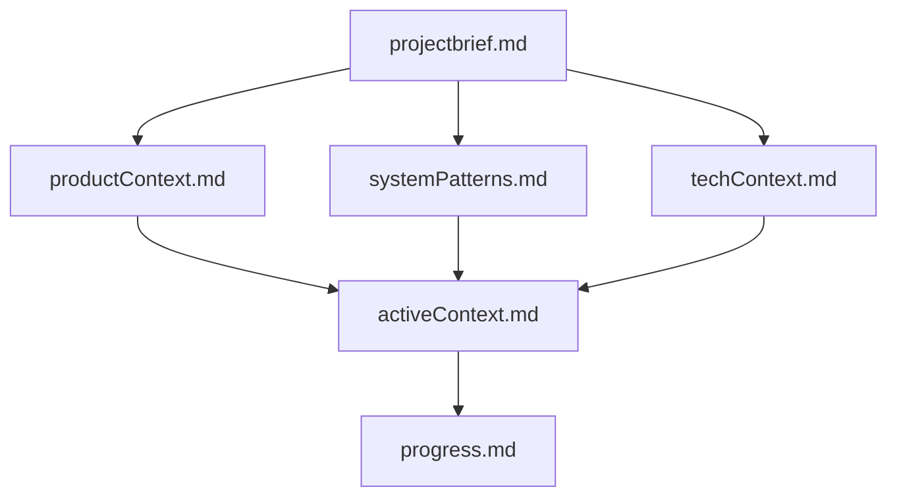

# Claude.md - Project Context for Out of the Books

## Operation Modes

I operate in two distinct modes:

### 1. Plan Mode (Default)
- I start in this mode and return to it after each response
- I gather information and create comprehensive plans without making changes
- I will display `# Mode: PLAN` at the beginning of each response
- I output the full updated plan in every response while in this mode

### 2. Act Mode
- I only enter this mode when you explicitly type `ACT`
- I execute the approved plan and make changes to the codebase
- I will display `# Mode: ACT` at the beginning of each response
- I return to Plan mode after completing the action

**Mode Switching Rules:**
- To enter Act mode: Type `ACT`
- To return to Plan mode: Type `PLAN` (or automatic after action)
- If you request an action while I'm in Plan mode, I'll remind you to approve the plan first

## Project Overview

**Name**: Out of the Books  
**Organization**: Out of the Books ASBL (non-profit organization)  
**Website**: outofthebooks.com  
**Mission**: Connect and inspire actors of educational change throughout the Francophonie, particularly in French-speaking Belgium.

## Project Context

This is a collaborative platform for educational innovation in French-speaking Belgium and the wider Francophonie. The platform brings together teachers, experts, and education enthusiasts to foster pedagogical innovation, connect stakeholders, and transform learning experiences.

### Key Features
- 🎯 Annual festival (3000+ participants)
- 🎙️ Podcasts and TV shows ("Pédagoscope")
- 📚 Pedagogical resources ("fiches pédagogiques")
- 👥 Community of 9000+ members
- 📱 Fully responsive, accessible platform
- 🌙 Dark mode support
- ⚡ High performance (>90 Lighthouse scores)

## Technical Stack

### Core Technologies
- **Framework**: Astro 5.0+ (Static Site Generation)
- **Styling**: Tailwind CSS (utility-first)
- **UI Components**: Astro (.astro) + React (.tsx) for interactive elements
- **Language**: TypeScript (strict mode) + JavaScript
- **Content Management**: 
  - NocoDB (structured data: events, workshops, stands)
  - Tina CMS (Git-based CMS for content editing)
- **Deployment**: Netlify

### Data Architecture
```
NocoDB API → Build Scripts → JSON Files → Astro SSG → Static HTML
Git Repo → Tina CMS → MDX/JSON Content → Astro Pages
```

### Key Directories
- `src/content/` - Content files (MDX, JSON)
- `src/components/` - Reusable components
- `src/services/api/nocodb/` - NocoDB integration
- `src/scripts/` - Build and data processing scripts
- `memory-bank/` - Project documentation and context

## Development Guidelines

### Commit Messages

Follow Conventional Commits specification:
`[type][(scope)]: [description]`

**Rules:**
- Use lowercase type and optional scope (e.g., feat, fix, refactor)
- Limit description to 60 characters maximum
- Include complete git commit command

**Examples:**
```bash
git commit -m 'feat(ui): add responsive layout with TailwindCSS'
git commit -m 'fix(modal): resolve accessibility issues on close'
git commit -m 'chore: initialize Astro project with TypeScript'
```

### Icons
- Use Tabler icons via `@iconify-json/tabler` and `astro-icon/components`
- Import: `import { Icon } from 'astro-icon/components'`
- Usage: `<Icon name="tabler:arrow-right" class="w-5 h-5" />`

### Images
- Use `Image.astro` component from `~/components/common/Image.astro`
- **Configuration:**
  - Widths: [400, 900]
  - Sizes: "(max-width: 900px) 400px, 900px"
  - Aspect ratio: 16:9
  - Loading: lazy
  - Decoding: async
- **Formats:** AVIF (primary) → WebP → JPG/PNG (fallback)
- **Sources:** Unsplash, Pexels, Freepik (with attribution)

Example:
```astro
<Image
  src={import('@/assets/image.avif')}
  widths={[400, 900]}
  sizes="(max-width: 900px) 400px, 900px"
  alt="Description significative"
  aspectRatio="16:9"
  loading="lazy"
  decoding="async"
  formats={['avif', 'webp', 'jpg']}
/>
```

### Code Quality Standards
- ✅ TypeScript strict configuration
- ✅ Tailwind classes only, mobile-first approach
- ✅ Atomic and reusable components
- ✅ Clear prop documentation (TypeScript & JSDoc)
- ✅ Follow SOLID principles
- ✅ Use Prettier and ESLint

### Performance & Accessibility
- **Google Lighthouse:** Score >90 for all criteria
- **EcoIndex Optimizations:**
  - DOM size <800 nodes
  - HTTP requests <40 per page
  - Resource weight <500KB per page
- **WCAG Compliance:**
  - Color contrast minimum 4.5:1
  - Semantic structure with ARIA landmarks
  - Fluid keyboard navigation
  - Respect `prefers-reduced-motion`

### Animations & Transitions
- Use Tailwind transition classes:
  ```html
  <button class="transition-all duration-300 ease-in-out hover:scale-105">
  ```
- Limit animations to essential interactions

### Component Architecture
```
src/
  components/
    common/     # Reusable components
    features/   # Feature-specific components
    layouts/    # Page layouts
    ui/         # Basic interface components
```
- Name components in PascalCase
- Document props with TypeScript and JSDoc
- Follow atomic design principles

### Utility Classes
- **EventFilters**: Smart filter management with French language support
- **EventPagination**: Clean pagination logic
- **EventRenderer**: Client-side event card rendering
- **French Language Support**: Gender agreement, context-aware translations

## Common Commands

```bash
# Development
npm install          # Install dependencies
npm run dev         # Start dev server
npm run build       # Build for production
npm run preview     # Preview production build

# Data Management
npm run build:events  # Generate event data from NocoDB
npm run fetch:events  # Sync latest content from NocoDB

# Quality
npm run lint        # Run ESLint
npm run typecheck   # TypeScript validation

# Custom Commands
/commit              # Generate standardized commit message
/generate-component  # Create new Astro component with TypeScript
/lint               # Run ESLint and Prettier
/optimize-performance # Analyze bundle performance
```

## Environment Variables

Required in Netlify:
- `NOCODB_API_TOKEN` - NocoDB API access
- `TINA_CLIENT_ID`, `TINA_TOKEN`, `TINA_SEARCH_TOKEN` - Tina CMS
- `CLOUDINARY_CLOUD_NAME`, `CLOUDINARY_API_KEY` - Media storage
- `BREVO_API_KEY`, `BREVO_LIST_ID` - Email services

## Current Focus Areas

### Performance Patterns
- Client-side rendering for dynamic content
- Deferred processing (100ms setTimeout for scrolling)
- Batch rendering (5 events at a time)
- Skeleton UI for perceived performance

### Content Management Evolution
- TinaCMS rich text support
- Flexible content rendering (string/rich text)
- Escaped character handling
- Progressive enhancement

### French Language Intelligence
- Gender agreement: "Toutes les conférences", "Tous les ateliers"
- Context-specific terminology
- Smart simplification for UX

## Development Best Practices

1. **Component Creation**: Always check existing patterns in `src/components/`
2. **Data Flow**: Follow the established NocoDB → JSON → Astro pattern
3. **Performance**: Test with Lighthouse, maintain >90 scores
4. **Accessibility**: Test with screen readers, keyboard navigation
5. **French Content**: Ensure proper gender agreement and terminology

## Project Status

The project is actively maintained with ongoing enhancements to:
- Event management system (filters, pagination, rendering)
- Content management integration (TinaCMS)
- Performance optimization
- User experience improvements

## Contact

Developer: Guillaume Gustin (pwablo.be)  
License: MIT

## Memory Bank Structure

The Memory Bank maintains project context across sessions through structured documentation:

### Core Files (Required)
1. **`projectbrief.md`**
   - Foundation document defining core requirements and goals
   - Source of truth for project scope
   - Created at project start

2. **`productContext.md`**
   - Why this project exists
   - Problems it solves
   - User experience goals

3. **`activeContext.md`**
   - Current work focus
   - Recent changes
   - Next steps
   - Active decisions

4. **`systemPatterns.md`**
   - System architecture
   - Key technical decisions
   - Design patterns in use
   - Component relationships

5. **`techContext.md`**
   - Technologies used
   - Development setup
   - Technical constraints
   - Dependencies

6. **`progress.md`**
   - What works
   - What's left to build
   - Current status
   - Known issues

### File Hierarchy


### Documentation Updates
Memory Bank updates occur when:
1. Discovering new project patterns
2. After implementing significant changes
3. When user requests with **update memory bank**
4. When context needs clarification

### .cursor/rules
The `.cursor/rules` file captures:
- Critical implementation paths
- User preferences and workflow
- Project-specific patterns
- Known challenges
- Tool usage patterns

---

*This document serves as the primary context for AI assistants working on this project. It should be updated as the project evolves.*