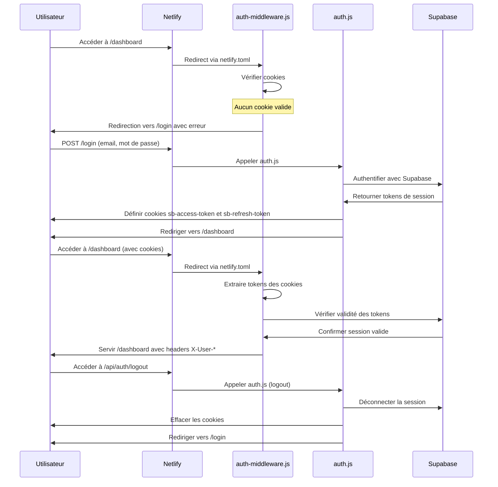

```mermaid
sequenceDiagram
    participant U as Utilisateur
    participant N as Netlify
    participant M as auth-middleware.js
    participant A as auth.js
    participant S as Supabase

    %% Cas 1 : Accès sans authentification
    U->>N: Accéder à /dashboard
    N->>M: Redirect via netlify.toml
    M->>M: Vérifier cookies
    Note over M: Aucun cookie valide
    M->>U: Redirection vers /login avec erreur

    %% Cas 2 : Connexion
    U->>N: POST /login (email, mot de passe)
    N->>A: Appeler auth.js
    A->>S: Authentifier avec Supabase
    S->>A: Retourner tokens de session
    A->>U: Définir cookies sb-access-token et sb-refresh-token
    A->>U: Rediriger vers /dashboard

    %% Cas 3 : Accès avec tokens valides
    U->>N: Accéder à /dashboard (avec cookies)
    N->>M: Redirect via netlify.toml
    M->>M: Extraire tokens des cookies
    M->>S: Vérifier validité des tokens
    S->>M: Confirmer session valide
    M->>U: Servir /dashboard avec headers X-User-*

    %% Cas 4 : Déconnexion
    U->>N: Accéder à /api/auth/logout
    N->>A: Appeler auth.js (logout)
    A->>S: Déconnecter la session
    A->>U: Effacer les cookies
    A->>U: Rediriger vers /login
``` 